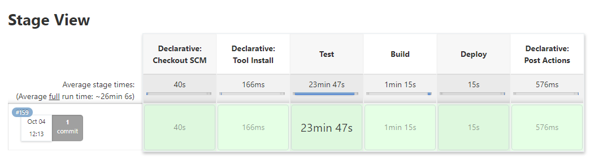

# spring-petclinic for EPAM DevOps Summer program 2021 
A sample Spring-based application on Java

I managed to implement such steps:
* Run maven tests of application in docker container on local Jenkins node launched in VirtualBox
* Initialise AWS instance (AppServer) with Terraform from Jenkins node launched on AWS EC2
* Prepare AppServer required for application with Ansible
* Build application JAR artifact on AWS Jenkins node
* Deliver application artifact to AppServer
* Run application on AWS AppServer

[Presentation PPTX](./FinalProject.pptx) [Presentation PDF](./FinalProject.pdf)

